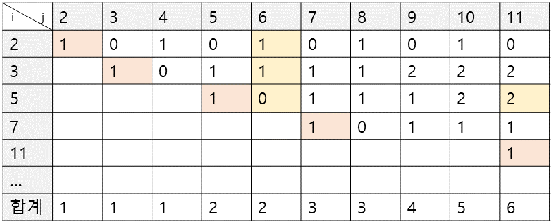

## 핵심 아이디어

처음 정답에 근접했던 방법이다.

$i$행이 2부터 N까지의 수들 중 소수만 저장한 배열 $p$의 인덱스,
$j$열이 2부터 N까지의 값일 때, 각 소수 $p_i$마다 $j$원을 만들 수 있는 방법의 가짓수를 표에 기록한 것이다.

* 가격이 소수와 동일한 경우

단 한가지 방법밖에 없으므로 1을 기록한다.

* 나머지 가격에 대해서는?

소수는 화폐의 최소 단위이므로, 만들고자 하는 가격 $j$에서 현재 소수 $p_i$를 뺀 가격 $j - p_i$를 만드는 경우의 수가 곧, 소수 $p_i$로 만들 수 있는 가격 $j$의 경우의 수가 된다.

하지만 이렇게 2차원 배열을 만들어 계산을 하게되면 점화식이

$$
dp[i][j] = \sum_{k=0}^i dp[k][j - p_i]
$$

가 되기 때문에 $\rm O(N^3)$의 복잡도가 나오게 되고 시간안에 해결할 수 없다.

### 해결 방법

생각보다 해결 방법은 간단했는데, 매번 가격 $p_i - j$를 만드는 경우의 수를 구하는 계산을 하지 않고 1차원 배열에 누적시켜주는 것이었다.

$$
dp[j] = dp[j] + dp[j - p_i];
$$

복잡도 $\rm O(N^2)$으로 해결이 가능하다. 소수 배열 $p$를 만들어 주었으므로 자세히는 $O(40000 \times 4000)$ 정도이다.
