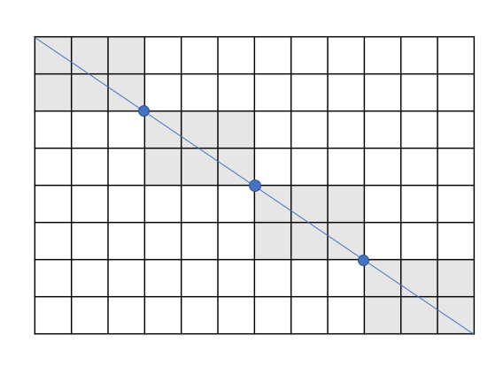
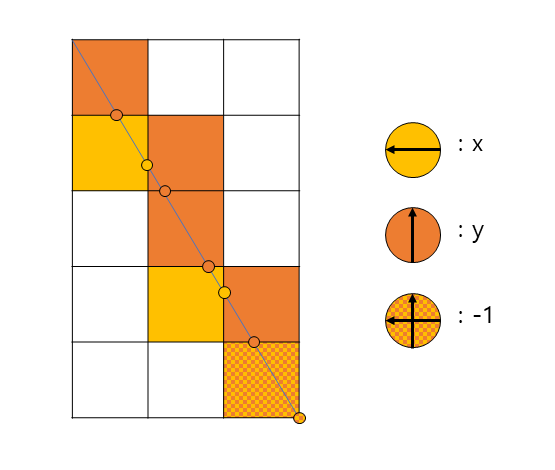

## 풀이 방법

문제에 나와있는 예시를 통해 설명해보겠다.

$8 \times 12$ 모양의 벽의 경우, 타일이 정사각형 모양이기 때문에 정확히 세개의 꼭짓점을 지나게 된다.

대각선이 지나는 타일의 전체 개수는 아직 알 수 없지만, 꼭짓점을 기준으로 문제를 $2 \times 3$ 크기의 벽 4개로 나눌 수 있어 보인다.

나누어진 $2 \times 3$ 크기의 벽을 잘 살펴보면 그어진 대각선은 단 하나의 꼭짓점도 지나지 않는다는 것을 알 수 있다. 즉, 더 이상 작은 크기의 벽으로 나눌 수 없는 최소 크기의 벽이라는 말이다.

 

그럼 주어진 크기의 벽으로부터 나눌 수 있는 최소 크기의 벽을 구하려면 어떻게 해야할까?

가로, 세로 값을 <u>더 이상</u> <u>나눠질 수</u> 없도록 만드는 <u>공통</u>의 수를 구하면 된다.

다시 말해 두 수의 최대공약수(gcd; **g**reatest **c**ommon **d**ivisor)를 찾으면 된다.

$8 \times 12$ 의 경우는 gcd값이 4이며, $2 \times 4 = 8$, $3 \times 4 = 12$ 이므로 $2 \times 3$ 크기의 벽 4개로 나눌 수 있음을 알 수 있다.

 

이렇게 최소 크기의 벽을 알아냈으면, 다음으로는 최소 크기의 벽 위에 그려진 대각선이 지나는 타일의 개수를 구해야 한다.

$3 \times 5$, $3 \times 7$, $2 \times 7$ 등 다양한 최소 크기의 벽을 조사해 보았더니 규칙을 찾을 수 있었다.

대각선이 세로선을 지날 때 왼쪽 타일을 포함시키고, 가로선을 지날 때 위쪽 타일을 포함시키도록 규칙을 세워 우측 하단까지 개수를 세어 보았더니 위와 같은 그림이 그려진다.

대각선은 타일을 포함시키는 유의미한 가로, 세로선을 각각 가로, 세로 크기만큼 지나며 마지막 타일은 중복되어 추가된다. 즉, 대각선이 지나는 타일의 개수는 `가로 크기 + 세로 크기 - 1` 이 된다.

 

최종적으로 최소 크기인 벽의 개수와 대각선이 지나는 타일의 값을 곱해주면 답이 된다.